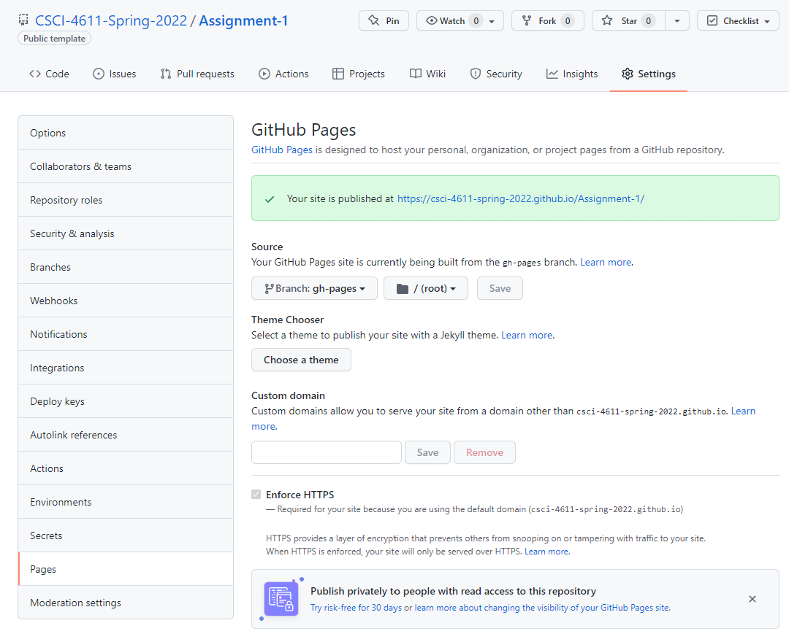

# Assignment 1: Space Minesweeper

**Due: Tuesday, February 1, 11:59pm CDT**

This assignment involves creating a simple, fun game using 2D graphics. You will learn to:

- Use TypeScript and Node.js for some serious programming
- Work with 2D graphics coordinate systems and primitives
- Animate computer graphics based on user input
- Implement game loops and event handlers

In general, assignments in this class are intended to be implemented in a step-by-step manner.  The rubric below lists all of the features you should implement, starting with the basic functionality and then working up to more advanced features.

You can try a [finished version of the game](https://csci-4611-spring-2022.github.io/Builds/Assignment-1/) in the Builds repository on the course GitHub. This is only a representative example, and you do not need to make your game look or play exactly the same. Your program can have a different look and feel, so long as it satisfies the requirements specified in the rubric.

## Submission Information

You should fill out this information before submitting your assignment. Make sure to document the name and source of any third party assets that you added, such as models, images, sounds, or any other content used that was not solely written by you. 

Name:

Third Party Assets:

Wizard Bonus Functionality:

## Prerequisites

To work with this code, you will first need to install [Node.js](https://nodejs.org/en/) and [Visual Studio Code](https://code.visualstudio.com/). 

## Getting Started

The starter code implements the general structure that we reviewed in lecture.  After cloning your repository, you will need to set up the initial project by pulling the dependencies from the node package manager with:

```
npm install
```

This will create a `node_modules` folder in your directory and download all the dependencies needed to run the project.  Note that this folder is `.gitignore` file and should not be committed to your repository.  After that, you can compile and run a server with:

```
npm run start
```

Webpack should launch your program in a web browser automatically.  If not, you can run it by pointing your browser at `http://localhost:8080`.

## Rubric

Graded out of 20 points.

The starter code includes a ship that rotate to point towards the mouse cursor.  First, we are going to make the ship move.  However, we want the ship to always be at the center of the screen.  Instead of moving the ship, we are going to create a starfield that moves in the opposite direction, thereby creating the *illusion* of ship movement. 

1. To achieve this, you should first create a bunch of small white stars of varying sizes and place them at random locations within the visible window.  Instead of creating a large number of `Path.Circle` objects, you should create only one circle, and then place multiple instances throughout the scene using a `Symbol`, as shown in this [tutorial](http://paperjs.org/tutorials/project-items/working-with-symbols/).  (1)
2. Next, move the stars by a small amount each frame to make the ship appear to move forward.  The velocity should increase proportional to the distance between the center of the view and the mouse cursor.  (2)
3. When a star goes outside the visible area of the screen, move it back the other side of the screen.  For example, if the `position.x` of the star is greater than the view width, then then set the `position.x` to 0.  This should create the effect of an infinite moving starfield in every direction the ship can fly.  (2)
4. Make the velocity of each star dependent on its size. Smaller stars should appear to move slower than bigger stars. This depth effect is known as [parallax](https://en.wikipedia.org/wiki/Parallax).  (1)

In the next steps, you will import a new vector graphics file, place a series of mines in the scene, and then animate them.

4. Import the `mine.svg` file, which is in the assets folder.  (1)
5. On some regular time interval, spawn a new mine and place it nearby, but **outside** of the visible area of the screen.  Similar to step 1, you should use a `Symbol` to place an instance of the original graphic file.  (2)
6. Make the mines move in the reverse direction, so that the ship appears to fly towards them, similar to the stars in step 2. (1)
7. Add a little additional movement to the mines to move each one slightly closer to the ship every frame.  This will give the appearance of "homing" in on the ship. (1)
8. Add a little rotation each frame, so that the mine appears to spin slowly. (1)
9. As the game runs, the number of mines will gradually increase.  Eventually this will add up and slow everything down until the game is unplayable.  To prevent this, place a maximum limit on the number of mines and remove the oldest one from the scene when it exceeds this value.  (2)

In the last stage of this project, you will implement the ability to destroy the mines.

9. When the user clicks the left mouse button, make the ship shoot a fast moving laser.  You can use a `Path.Rectangle` for this. (2)
10. The laser should be removed from the scene when it leaves the visible area of the view.   Similar to step 9, this will prevent an infinite number of lasers to be added and slow down the game. (1)
11. When a laser collides with a mine, both the laser and the mine should be removed from the scene. (1)
12. When a mine is removed from the scene, add an explosion effect.  In the example program, this was achieved using a rapidly expanding circle.  However, you are free to implement this animation using whatever shapes or methods you want. Creativity is encouraged! (2)

## Wizard Bonus Challenge

All of the assignments in the course will include great opportunities for students to go beyond the requirements of the assignment and do cool extra work. On each assignment, you can earn **one bonus point** for implementing a meaningful new feature to your program. This should involve some original new programming, and should not just be something that can be quickly implemented by copying and slightly modifying existing code.  

For example, in this assignment, you could potentially implement the logic to turn this into a fully functional game.  This could involve making the mines capable of destroying the player's ship, implementing a point system, etc.  Alternatively, you could program a new type of enemy or weapon, possibly by importing new assets.  [Kenney](https://www.kenney.nl/assets) is a great source for free images and models to use in game development, and [Inkscape](https://inkscape.org/) is a useful open-source program for manipulating vector graphics. Or, even better, think of your own cool, creative idea!

A single point may not sound like a lot, but keep in mind that on a 20-point scale, this is equivalent to a 5% bonus! Make sure to document your wizard functionality in the Submission Information portion of this readme file, so that the TAs know what to look for when they grade your program.

The wizard bonus challenge also offers you a chance to show off your skills and creativity!  While grading the assignments the TAs will identify the best four or five examples of people doing cool stuff with computer graphics. We call these students our **wizards**, and after each assignment, the students selected as wizards will have their programs demonstrated to the class.

## Submission

When you commit and push your assignment to GitHub, an automated script will build and deploy the production code to the `gh-pages` branch of your repository.  However, your submission is not complete until you do the following:

1. Open your repository on GitHub and go to Settings->Pages.
2. Change the source to the `gh-pages` branch, then save.



You will need to wait a few minutes for the website to deploy.  After that, make sure to test everything by pointing your web browser at the link generated for your build:

```
https://csci-4611-spring-2022.github.io/your-repo-name-here
```

If your program runs correctly, then you are finished!  The published build will indicate to the TAs that your assignment is ready for grading.  If you change your mind and want to make further changes to your code, then just set the GitHub pages source back to `None` and it will unpublish the website.

Note that the published JavaScript bundle code generated by the TypeScript compiler has been minified and obfuscated so that it is not human-readable. So, you can feel free to send this link to other students, friends, and family to show off your work!

## Acknowledgments

The ship and mine vector graphics were from the Kenney [Simple Space](https://www.kenney.nl/assets/simple-space) asset package.

## License

Material for [CSCI 4611 Spring 2022](https://canvas.umn.edu/courses/290928/assignments/syllabus) by [Evan Suma Rosenberg](https://illusioneering.umn.edu/) is licensed under a [Creative Commons Attribution-NonCommercial-ShareAlike 4.0 International License](http://creativecommons.org/licenses/by-nc-sa/4.0/).